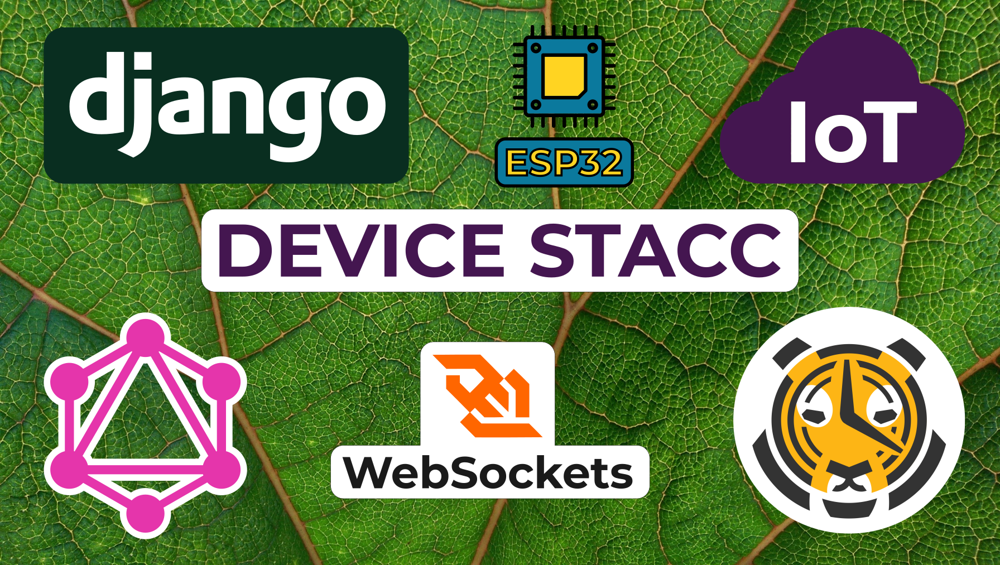
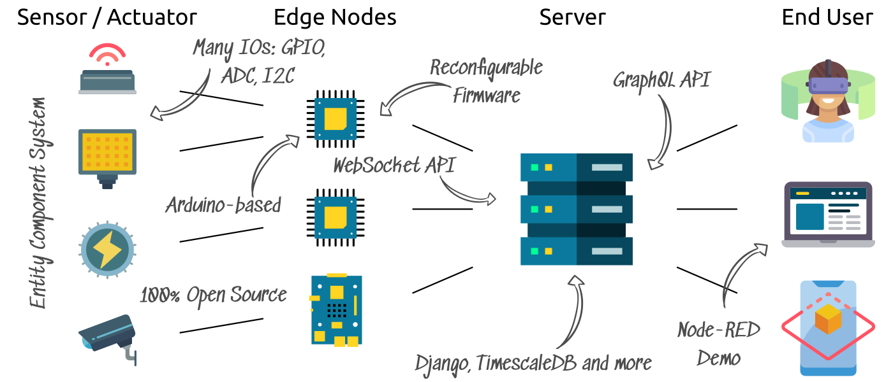
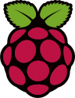

# SmartDigitalGarden / DeviceStacc Server

Test drive on core.openfarming.ai.

A data analytics and control platform for IoT systems. It integrates with the [sdg-controller firmware][1] for ESP32s to dynamically add peripherals and then measure and control them. In the second version, currently under development, InfluxDB was replaced with TimescaleDB, the REST API with GraphQL and the MQTT broker with WebSockets. The application is structured to separate the IoT aspect from the domain aspect (hydroponic greenhouses) to allow it to subsequently be broken out into a **standalone service**. This will allow domain specific IoT solutions to be written.

For the current roadmap, it will be used to visualize and allow the analysis of data covering the growth aspects of hydroponically grown plants. It is being developed as part of the [OpenFarmingAI research project][7] and will be receiving a project website in the coming weeks.

Aspects that are under development include an AR application to stream realtime data, a VR application to act as a learning platform for hydroponics and an AI to segment leaves and analyze a plants current health.

- [SmartDigitalGarden / DeviceStacc Server](#smartdigitalgarden--devicestacc-server)
  - [⚠️ Current Development Status](#️-current-development-status)
  - [Roadmap](#roadmap)
    - [✅ Alpha 1 (IoT): MVP Without Using the Admin Interface](#-alpha-1-iot-mvp-without-using-the-admin-interface)
    - [🔀 Alpha 2 (GH): Add Image Handling](#-alpha-2-gh-add-image-handling)
    - [Alpha 3 (IoT): GraphQL Subscriptions](#alpha-3-iot-graphql-subscriptions)
    - [Alpha 4 (IoT): Add Calibration Workflow](#alpha-4-iot-add-calibration-workflow)
    - [Alpha 5 (GH): Add AI Inference API](#alpha-5-gh-add-ai-inference-api)
    - [Alpha 6 (IoT): Add a Flash Tool](#alpha-6-iot-add-a-flash-tool)
    - [Alpha 7 (IoT/GH): Add RPi and Azure Kinect Edge Node](#alpha-7-iotgh-add-rpi-and-azure-kinect-edge-node)
    - [Alpha 8 (IoT): Visualization and Data Performance](#alpha-8-iot-visualization-and-data-performance)
    - [Beta 1 (IoT): Management UI](#beta-1-iot-management-ui)
  - [Requirements](#requirements)
    - [Required](#required)
    - [Optional](#optional)
  - [Starting the Services](#starting-the-services)

## ⚠️ Current Development Status 

The stage of MVP (Minimal Viable Product) has been reached an can be tested on core.openfarming.ai. This means LEDs can be toggled, BME280 air sensor polled and the data queried as well as GUIs covering the core functionality. Future releases will be released on a separate domain.

More information on the core web service can be found in its [documentation](./core/README.md). For a high-level overview, see the [Device Stacc post](https://hackernoon.com/device-stacc-a-reconfigurable-iot-platform-6j4e322p) on Hackernoon.

A for-payment service will be provided (next to a free tier) once everything has settled more and I don't feel ashamed to charging for it. Proprietary code will be limited to features required for payment and larger teams, similar to Gitlab's approach.

## Roadmap ##

The roadmap is split between releases that focus on the core IoT domain and the greenhouse domain. The IoT domain is useful all users, while the greenhouse (GH) domain focuses on the requirements of the [OpenFarming.AI][7] research project at the [Protohaus gGmbH][9]. Contributions and feedback are welcome regarding any aspect. Initial work began at the end of 2017 and includes several rewrites since then.

### ✅ Alpha 1 (IoT): MVP Without Using the Admin Interface

Create a minimal stack that allows the platform to be useful. Allow reading and controlling an ESP32 as well as managing sites and controllers without the admin interface.

|  |  |  |  |  |  |
| ---------------------------- | -------------------------- | -------------------------- | ---------------------------- | -------------------------- | -------------------------- |
| Authentication               | Controller FW              | WebSocket API              | GraphQL API                  | Node-RED Demo              | Setup UI                   |
| Done: 05.02.19               | Done: 25.01.21             | Done: 15.11.20             | Done: 09.12.20               | Done: 25.01.21             | Done: 13.03.21             |

### 🔀 Alpha 2 (GH): Add Image Handling

Allow images to be uploaded and queried.

|  |  |
| -------------------------- | ---------------------------- |
| Backend                    | GraphQL                      |
| TBD                        | TBD                          |

### Alpha 3 (IoT): GraphQL Subscriptions

Allow GraphQL subscriptions to be created on data points.

|  |  |
| -------------------------- | ---------------------------- |
| Backend                    | GraphQL                      |
| TBD                        | TBD                          |

### Alpha 4 (IoT): Add Calibration Workflow

Allow calibrations to be performed. Add further drivers for controller peripherals.

|  |  |
| -------------------------- | -------------------------- |
| FW Drivers                 | NodeRED UI                 |
| TBD                        | TBD                        |

### Alpha 5 (GH): Add AI Inference API

Allow images to be passed to an AI to infer plant state. To be implemented as an external Docker service.

|  |  |
| -------------------------- | -------------------------- |
| FastAPI Service            | TensorFlow Model           |
| TBD                        | TBD                        |

### Alpha 6 (IoT): Add a Flash Tool

Allow ESPs to be registered and flashed with a downloadable tool.

|  |  |  |  |  |
| -------------------------- | ---------------------------- | -------------------------- | ---------------------------- | ---------------------------- |
| Backend                    | ESP Flash Tool               | OAuth Client               | Windows App                  | Linux App                    |
| TBD                        | TBD                          | TBD                        | TBD                          | TBD                          |

### Alpha 7 (IoT/GH): Add RPi and Azure Kinect Edge Node

Allow Raspberry Pis and cameras to be integrated.

|  |  |  |
| ---------------------------- | -------------------------- | -------------------------- |
| RPi Controller               | WebSocket API              | Backend                    |
| TBD                          | TBD                        | TBD                        |

### Alpha 8 (IoT): Visualization and Data Performance

Add Grafana integration to visualize data points. Rework TimescaleDB as an unmanaged model to improve compression and use its API.

|  |  |  |
| -------------------------- | -------------------------- | -------------------------- |
| OAuth Server               | Grafana                    | TimescaleDB                |
| Done: 23.01.19             | TBD                        | TBD                        |

### Beta 1 (IoT): Management UI

Add an Angular application to replace the Node-RED demo app. Initial test code has been written in the planner app.

|  |  |
| -------------------------- | -------------------------- |
| Angular Redux              | Angular                    |
| TBD                        | TBD                        |

## Requirements

### Required

- **Docker:** available for [Ubuntu][2], [Mac][3], [Windows][4] and other [Linux flavors][5]. Note that currently only Ubuntu is supported.
- **Docker Compose:** the official [installation guide][6]
- **Python:** Version 3.8 or above (Django in core)
- **Traefik:** As the reverse proxy
- **Secrets:** Secret templates have to be copied and secrets generated (`pwgen -s 64`)
  - core/secrets.core
  - core/secrets.rabbitmq
  - postgres/secrets.postgres

### Optional

- **SMTP server:** To enable user registration, credentials to an SMTP server are required. For testing purposes, the admin account may be used.

## Starting the Services

Start the complete setup with:

    ./start.sh development

Or in a production or staging environment use:

    ./start.sh <production|staging>

Stop the setup with:

    ./start.sh <development|staging|production> stop

List the individual services with `docker ps`. Key data to the individual services:

| Name     | Purpose            | Port | Documentation                     |
| -------- | ------------------ | ---- | --------------------------------- |
| core     | Backend            | 8000 | [readme](core/README.md)          |
| postgres | User storage       | 5432 | N/A                               |
| node-red | Demo frontend      | 1880 | [readme](node-red-demo/README.md) |
| rabbitmq | Async task storage |      | N/A                               |
| traefik  | Reverse proxy      |      | N/A                               |

The data is stored in volumes. List all active volumes with `docker volume ls`.

[1]: https://github.com/protohaus/sdg-controller
[2]: https://docs.docker.com/install/linux/docker-ce/ubuntu/
[3]: https://docs.docker.com/docker-for-mac/install/
[4]: https://docs.docker.com/docker-for-windows/install/
[5]: https://docs.docker.com/install/
[6]: https://docs.docker.com/compose/install/#install-compose
[7]: https://www.photonikforschung.de/projekte/open-innovation/projekt/openfarmingai.html
[8]: https://semantic-ui.com/introduction/getting-started.html#installing
[9]: https://www.protohaus.org/
