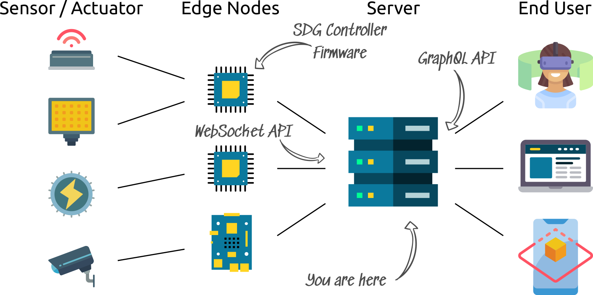
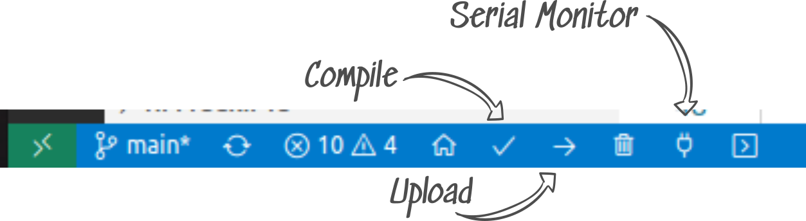

# Core Service

The Django application acts as the backend for the admin site, the WebSockets, the connection between controllers, databases and user applications (frontend, VR/AR applications).

- [Core Service](#core-service)
  - [Installation](#installation)
  - [Development with the SDG Controller and the Node-RED Demo](#development-with-the-sdg-controller-and-the-node-red-demo)
    - [Changes to Core Service](#changes-to-core-service)
    - [Changes to SDG Controller](#changes-to-sdg-controller)
    - [Changes to the Node-RED Demo](#changes-to-the-node-red-demo)
  - [Tests](#tests)
  - [Database Migrations](#database-migrations)
  - [Save and Load Seed Data](#save-and-load-seed-data)
  - [Options](#options)
  - [Using Local DNS Resolution](#using-local-dns-resolution)
  - [Regitering New OAuth2 Applications](#regitering-new-oauth2-applications)
    - [Depreciated](#depreciated)
  - [Troubleshooting](#troubleshooting)

## Installation

After installing *Docker*, run the install script:

    ./install.sh

Start with:

    ./start.sh

This starts Django in development mode at [localhost:8000](http://localhost:8000). To log in, use the default superuser creditials defined in `secrets.core` by the following variables:

    DJANGO_SUPERUSER_EMAIL
    DJANGO_SUPERUSER_PASSWORD

The `DJANGO_DEBUG` variable in `env.core` is only respected when starting from the root Docker Compose file.

## Development with the SDG Controller and the Node-RED Demo

To use the core service with an SDG controller (ESP32 firmware) and a Node-RED frontend the authentication and binding of the web server have to be updated.

### Changes to Core Service

1. Change the `CORE_DOMAIN` variable in `secrets.core` to the local network IP address (the one assigned to the network adapter instead of localhost).
2. Check that tokens have been created
   1. under *Auth Token* on the [Django admin site](http://localhost:8000/admin/authtoken/tokenproxy/)
   2. and under *Farms* in the *Controller auth tokens* section.
   3. If not, clear the DB with `./start.sh clean` and run `./start.sh` again or create them yourself.
3. Restart the core server (kill the server with Ctrl + C and run `./start.sh`).
4. Open a browser at the new address.

### Changes to SDG Controller

1. Set up the [PlatformIO extension](https://platformio.org/platformio-ide) for [VS Code](https://code.visualstudio.com/).
2. Clone the [SDG Controller repository](https://github.com/protohaus/sdg-controller) and open it in VS Code.
3. In the `src/configuration.cpp` file
   1. add your WiFi credentials to `access_points`
   2. update `core_domain` to the one set above
   3. and set the `ws_token` to the token from the *Controller auth tokens* section. Prefix the token with `token_`. The default should already be set to the one provided by the DB seed for the core service.
4. Compile and upload the controller code.
5. Check the connection by opening the serial monitor.

### Changes to the Node-RED Demo

Follow the setup instructions provided in the [Node-RED Demo readme](../node-red-demo/README.md).

## Tests

The tests try to mirror the production environment throught the use of their respective Docker services. The command to run test all tests:

    ./start.sh test

To just run a single test use, for example:

    ./start.sh test farms.tests.test_ws_controller.TestControllerMessage.test_authentication

The command to create an HTML report of the test coverage:

    ./start.sh coverage

## Database Migrations

For a database migration, the web app has to be started outside Docker (the database may run in Docker). First make sure the database is up-to-date:

    ./start.sh makemigrations

The `migrate` command is called by default by the `start.sh` script

## Save and Load Seed Data

To save the current state of the database to a file:

    ./start.sh dumpdata /path/to/db_seed.json

To load the saved data into a database:

    ./start.sh loaddata /path/to/db_seed.json

To clear development data, run the following command. The development environment is setup so that the database data is cleared when the Docker services are stopped.

    ./start.sh clean

## Options

To start the web server with a custom port and host binding change the following variables in configuration in the `secrets.core` file:

    CORE_DOMAIN
    CORE_DEV_SERVER_PORT

## Using Local DNS Resolution

To enable DNS and subdomains add the following entries to your `/etc/hosts` file

    # Useful for development of the SDG server
    127.0.0.1       data.sdg.local
    127.0.0.1       core.sdg.local
    127.0.0.1       sdg.local
    127.0.0.1       www.sdg.local

Then update the `secrets.core` file with the entry

    CORE_DOMAIN=core.sdg.local

## Regitering New OAuth2 Applications

To register a new OAuth2 application (such as Grafana)
1. Go to the OAuth2 Dashboard (https://core.openfarming.ai/o/applications/)
2. Click the link to register a new application
3. Type in an application name
4. Copy the client ID and secret into the `grafana/secrets.grafana` file
5. Set the client type and authorization grant type (*Confidential* and *Authorization Code*)
6. Add the redirect URI from the `grafana/secrets.grafana` file
7. Save the new OAuth2 application
8. Go to the Admin Dashboard (https://core.openfarming.ai/admin/)
9. Go to the new application (Oauth2_Provider --> Applications --> *Application Name*)
10. Enable *Skip authorization* at the bottom of the page
11. Save the changes

### Depreciated

The Node-RED demo is configured to use a simple authentication token. The setup is documented in the [node-red-demo readme](../node-red-demo/README.md). The documentation below is for using OAuth2 with Node-RED.

To start a NodeRED instance, start the following Docker service:

    docker run -it --rm --network host -v /path/to/sdg-coordinator/node-red/settings.js:/data/settings.js --name mynodered nodered/node-red

To register a NodeRED application
1. Go to the OAuth2 Dashboard (https://core.openfarming.ai/o/applications/)
2. Click the link to register a new application
3. Type in an application name
4. Copy the client ID and secret into the `Secrets` node on the `SDG Login` tab
5. Set the client type: *Confidential* and authorization grant type: *Resource owner password-based / password*
6. Save the new OAuth2 application

## Troubleshooting

See the [troubleshooting doc](./TROUBLESHOOTING.md).