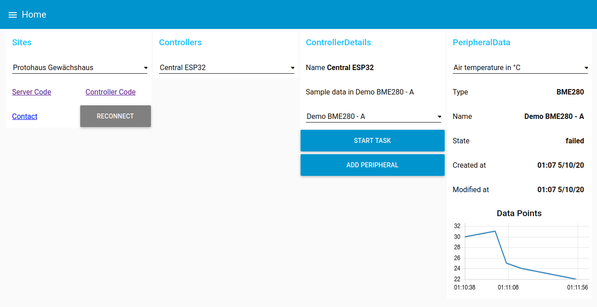
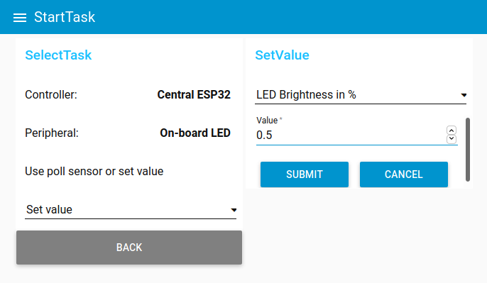
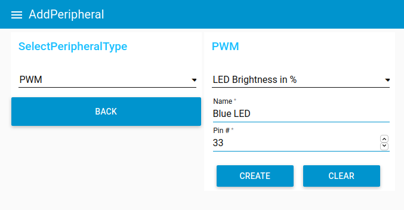

# Node-RED Demo

This Node-RED demo is used to show the interaction with the GraphQL API. To use it, start a Node-RED instance (e.g. [in Docker](https://nodered.org/docs/getting-started/docker)) and then upload this file.

## Setup

To start a local Node-RED instance use the following command. It creates a Docker instance with persistant storage and uses the host networking so that it can access the server with its localhost address.

    docker run -d --network=host -v sdg-node_red_data:/data --name sdg-nodered nodered/node-red

Open a web browser at `127.0.0.1:1880` to see the Node-RED backend. First of all, the required node packages have to be installed. To install them, open the hamburger menu in the top right and select `Manage palette`. Select the `Install` tab and install the following nodes:

- node-red-dashboard
- node-red-contrib-graphql

Next, import the Node-RED flows. Open the hamburger menu in the top right and select `Import`. Press `select a file to import` and choose the `flows.json` file in this directory. Then press import. The flows will be placed in the Home and other tabs. The `Flow 1` flow may be deleted by double clicking the tab and then selecting `Delete`.

One configuration has to be updated to be able to connect to the GraphQL endpoint. To do this
1. go to the hamburger menu and select `Configuration nodes`.
2. Then, double click the `SDG Server Dev` node under the `graphql-server` type
3. The endpoint has to be updated with the correct IP address and port of the core service. This can be found in `core/secrets.core` file under the `CORE_DOMAIN` environment variable.
4. The authorization header is derived from the auth token in the core service (Django Admin → Auth Token → Tokens). To use the default token, copy the following into the `Authorization Header` field:

    Token: 543504d764fe2b729fac541f534f10a23fca4e6f

5. Deploy the changes by pressing the deploy button in the top right hand corner.
6. Go to the [Node-RED frontend](http://127.0.0.1:1880/ui/).

## Demo Usage

Open the frontend at http://127.0.0.1:1880/ui/ to be able to interface with the Core service.

### View Peripheral Info and Data Points

To see the details as in the opening image

1. select `Protohaus Gewächshaus` in the `Sites` section.
2. select `Central ESP32` in the `Controllers` section.
3. select `Demo BME280 - A` in the `ControllerDetails` section.
4. select either humidity, air pressure or temperature in the `PeripheralData` section.

### Turn the On-Board LED On and Off

The database seed of the Core service contains two LEDs, one for the on-board and an external LED. By default, a task should start to turn it on. To turn the LED on or off

1. select `Protohaus Gewächshaus` in the `Sites` section.
2. select `Central ESP32` in the `Controllers` section.
3. select `On-board LED` in the `Connected Peripherals` dropdown menu.
4. press the `START TASK` button
5. select the `Set value` option in the dropdown menu
6. select `LED Brightness` in the dropdown in the `SetValue` section
7. Enter a value between 0 and 1 in the `value` field
8. Press the `submit` button

### Add a New Peripheral

To add a new peripheral, such as a PWM driven LED

1. select `Protohaus Gewächshaus` in the `Sites` section.
2. select `Central ESP32` in the `Controllers` section.
3. press the `ADD PERIPHERAL` button
4. select the `PWM` option in the dropdown menu
5. select `LED Brightness` in the `Select PWM type` dropdown menu
6. enter a name in the `Name` field
7. enter a pin number in the `Pin #` field
8. press the `CREATE` button

